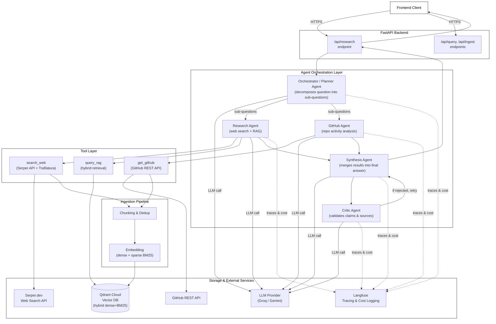
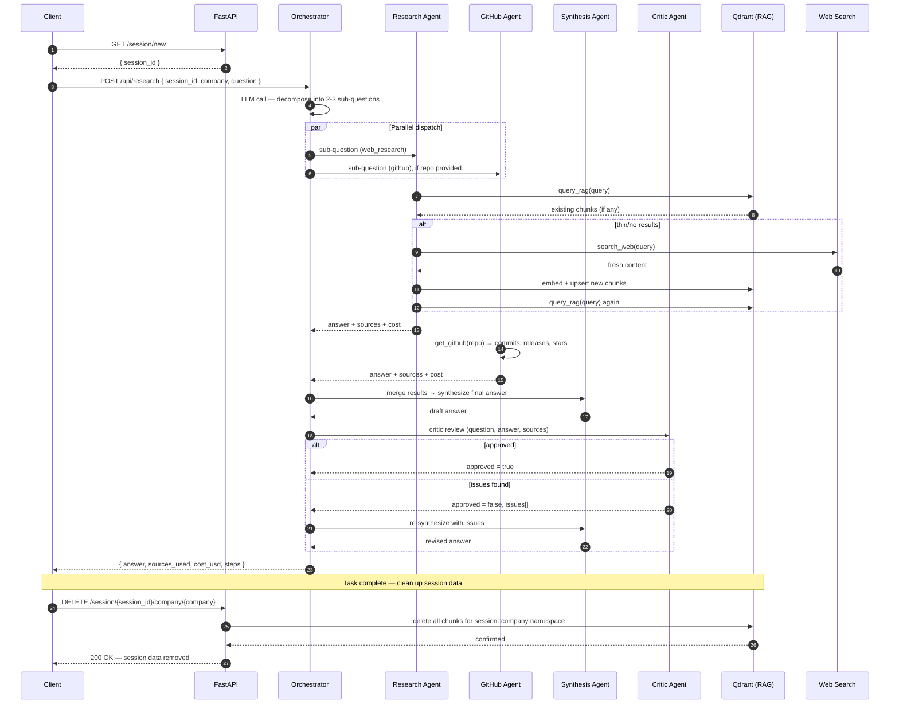

# Company Research Tool — Backend

[](https://youtu.be/j5wpOb3YA3M)

> **▶ [Visit Video](https://youtu.be/j5wpOb3YA3M)**

---

## Overview

A multi-agent, retrieval-augmented research API that answers natural-language questions about companies by combining live web search, GitHub developer-activity signals, and a persistent vector knowledge base — with built-in cost tracking, observability, and an automated quality-control (critic) loop.

Given a question like *"What is the current funding status and recent product direction of Company X?"*, the system:

1. Plans the question into focused sub-questions
2. Dispatches specialist agents to research each sub-question in parallel (web search + RAG, and optionally GitHub activity)
3. Synthesizes a single, source-cited answer
4. Runs a critic agent to catch hallucinations or unsourced claims, and re-synthesizes if issues are found
5. Returns the answer along with sources used and total cost

---

## Architecture



---

## Agent Flow (Sequence)



---

## Key Features

- **Multi-agent orchestration** — A planning agent decomposes user questions into sub-questions, routes them to specialist agents (web research, GitHub analysis), and runs them concurrently.
- **Hybrid RAG retrieval** — Combines dense vector search (BAAI/bge-small-en-v1.5 embeddings) with sparse BM25 search via Qdrant's Reciprocal Rank Fusion, scoped per session and company.
- **Self-correcting synthesis loop** — A critic agent reviews the synthesized answer for hallucinated facts or missing sources and triggers a re-synthesis pass if issues are found.
- **Cost & token tracking** — Every LLM call logs token usage and per-step cost (USD), aggregated and returned to the client.
- **Full observability** — Integrated with Langfuse for distributed tracing across the entire agent graph (reasoning steps, tool calls, generations).
- **Prompt-injection sanitization** — Tool results (web content, GitHub data) are scanned and sanitized for common prompt-injection patterns before being fed back to the LLM.
- **Deduplication & chunking pipeline** — Scraped content is deduplicated via content hashing, chunked with overlap, embedded, and upserted into Qdrant.
- **Session-scoped multi-tenancy** — All ingested and retrieved data is namespaced by `session_id::company`, isolating data between concurrent users/companies.
- **Async background ingestion jobs** — Long-running company research ingestion runs as a background task with job-status polling.
- **Pluggable LLM provider** — Switches between Groq (Llama models) and Google Gemini via a single config flag.

---

## Tech Stack

| Layer | Technology |
|---|---|
| API Framework | FastAPI, Uvicorn |
| Agent Orchestration | LangGraph, LangChain |
| LLM Providers | Groq (Llama 3.1/3.3), Google Gemini 2.0 Flash |
| Vector Database | Qdrant Cloud (hybrid dense + BM25) |
| Embeddings | FastEmbed (BAAI/bge-small-en-v1.5, Qdrant/bm25) |
| Web Search | Serper.dev API |
| Content Extraction | Trafilatura |
| Observability | Langfuse (tracing + cost logging) |
| Package Management | uv |
| Containerization | Docker, Docker Compose |
| Deployment | AWS EC2, Caddy (auto HTTPS via nip.io) |

---

## API Endpoints

| Method | Endpoint | Description |
|---|---|---|
| `GET` | `/` | Health check |
| `GET` | `/session/new` | Generate a new session ID |
| `POST` | `/api/research` | Run full multi-agent research pipeline for a company/question |
| `POST` | `/api/agent/query` | Run a single research agent against the knowledge base |
| `POST` | `/api/query` | Direct RAG retrieval query |
| `POST` | `/api/ingest/company` | Kick off async ingestion job for a company |
| `GET` | `/api/jobs/{job_id}` | Poll ingestion job status |
| `GET` | `/api/companies/{company}/chunks` | Retrieve all stored chunks for a company |
| `DELETE` | `/api/session/{session_id}/company/{company}` | Delete all stored data for a session/company |

---

## Project Structure

```
app/
├── agent/
│   ├── orchestrator.py     # Planning agent — decomposes questions, dispatches sub-agents
│   ├── research_agent.py   # Web research + RAG specialist agent
│   ├── github_agent.py     # GitHub activity specialist agent
│   ├── synthesis_agent.py  # Merges agent outputs into final cited answer
│   ├── critic_agent.py     # Validates answer against sources
│   ├── graph.py            # LangGraph reasoning/act/observe loop
│   ├── tools.py            # Tool implementations (search_web, get_github, query_rag)
│   ├── tool_registry.py    # Tool schema definitions
│   ├── sanitizer.py         # Prompt-injection detection/stripping
│   └── state.py             # Agent state schema
├── ingestion/
│   ├── scraper.py           # Web search + content extraction
│   ├── github_client.py     # GitHub REST API client
│   ├── chunking.py          # Text chunking + fingerprinting
│   ├── deduplicator.py       # Content-hash deduplication
│   ├── embedding.py          # Dense + sparse embedding generation
│   ├── qdrant_client.py      # Qdrant collection management & queries
│   └── pipeline.py           # End-to-end ingestion pipeline
├── rag/
│   └── retriever.py          # Hybrid retrieval (dense + BM25 fusion)
├── api/
│   ├── research.py            # /api/research route
│   └── query.py               # /api/query, /api/ingest, job status routes
├── observability/
│   ├── tracer.py               # Langfuse/OpenTelemetry setup
│   └── costlogger.py           # Per-call cost computation
├── core/
│   ├── models.py                # Pydantic data models (Chunk, JobStatus, etc.)
│   └── dependencies.py          # Qdrant client dependency injection
└── config/
    └── settings.py              # Environment-based configuration
```

---

## Running Locally

### Prerequisites
- Python 3.12+
- [uv](https://docs.astral.sh/uv/) package manager
- A Qdrant Cloud instance (or self-hosted)
- API keys: Groq or Google Gemini, Serper.dev, GitHub, Langfuse

### Setup

```bash
git clone <repo-url>
cd company_research_tool

# install dependencies
uv venv && uv sync

# configure environment
cp .env.example .env
# fill in your API keys and Qdrant credentials

# run the server
uv run uvicorn main:app --reload
```

The API will be available at `http://localhost:8000`.

### Environment Variables

| Variable | Description |
|---|---|
| `LLM_PROVIDER` | `groq` or `google` |
| `GROQ_API_KEY` | Groq API key (if using Groq) |
| `GOOGLE_API_KEY` | Google Gemini API key (if using Gemini) |
| `X_API_KEY` | Serper.dev web search API key |
| `GITHUB_TOKEN` | GitHub personal access token |
| `QDRANT_BASE_URL` | Qdrant Cloud cluster URL |
| `QDRANT_API_KEY` | Qdrant Cloud API key |
| `COLLECTION_NAME` | Qdrant collection name |
| `WEB_SEARCH_COST` | Estimated cost per web search call (USD) |
| `LANGFUSE_PUBLIC_KEY` / `LANGFUSE_SECRET_KEY` / `LANGFUSE_BASE_URL` | Langfuse observability credentials |

---

## Deployment

The backend is containerized and deployed on AWS EC2 behind Caddy for automatic HTTPS:

```bash
docker compose up -d --build
```

- **App container**: FastAPI + Uvicorn, built via `uv`
- **Caddy container**: Reverse proxy with automatic Let's Encrypt TLS (via nip.io for IP-based HTTPS)
- **Qdrant**: Externally hosted on Qdrant Cloud

---

## Design Decisions & Trade-offs

- **LangGraph over a custom agent loop**: provides a clean state machine (`reason → act → observe`) with built-in step limits, avoiding infinite tool-call loops.
- **Hybrid retrieval (dense + BM25)**: pure dense retrieval misses exact keyword matches (e.g. company names, version numbers); RRF fusion balances semantic and lexical relevance.
- **Critic + re-synthesis loop**: a single LLM pass is prone to unsourced claims; a dedicated critic pass with a bounded retry materially improves answer reliability at modest extra cost.
- **Session-scoped namespacing**: avoids cross-contamination of RAG data between different users researching the same company simultaneously.
- **Groq/Gemini pluggable provider**: keeps the system runnable on free/low-cost tiers during development while remaining provider-agnostic.

---

## Future Improvements

- Streaming responses (SSE/WebSocket) for incremental answer delivery
- Caching layer for repeated sub-question queries within a session
- Structured tool-calling via native LLM function-calling instead of JSON-in-text parsing
- More robust JSON-parsing fallbacks for orchestrator/sub-agent outputs
- Rate-limiting and authentication on public endpoints
